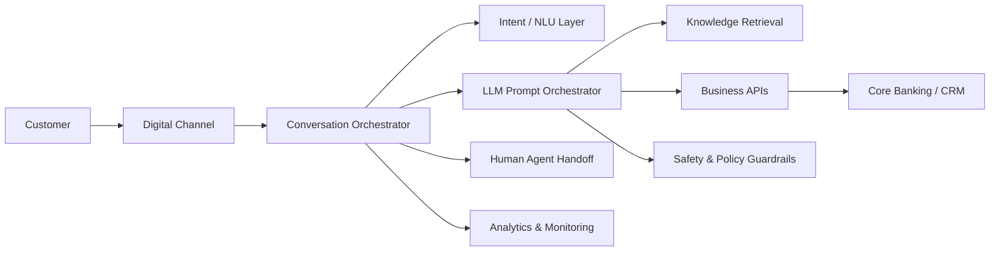

# AI Agentic Workflows for Banking Conversational AI

Portfolio repository demonstrating how conversational AI and generative AI workflows can be structured for banking customer-service use cases using prompt orchestration, guardrails, API integration, and human handoff patterns.

> This repository contains only generic, non-proprietary examples. It does not include confidential client data, production prompts, credentials, or internal architecture.

## What this repository demonstrates

- Conversational AI delivery thinking
- Prompt chaining and orchestration
- Banking intent design
- API integration checkpoints
- Guardrails and escalation
- Observability and quality controls
- Delivery governance for AI-enabled programs

## Reference architecture

## Sample banking use cases

1. Account balance and recent transactions
2. Card blocking and replacement
3. Loan eligibility pre-check
4. Payment-status inquiry
5. FAQ resolution using retrieval-augmented generation
6. Complaint triage and escalation

## Suggested delivery lifecycle

1. Define business outcomes and supported intents.
2. Classify high-risk versus low-risk journeys.
3. Design dialogue states and fallback paths.
4. Define prompt templates and grounding sources.
5. Add API contracts and authentication boundaries.
6. Add guardrails for privacy, financial advice, hallucination, and unsupported actions.
7. Define test scenarios and acceptance thresholds.
8. Pilot with monitored traffic.
9. Review containment, transfer, CSAT, latency, and defect trends.
10. Iterate through governed releases.

## Repository structure

- `prompts/prompt-chaining-template.md`
- `blueprints/banking-agent-flow.md`
- `governance/ai-delivery-checklist.md`

## Leadership lens

The focus is not only on building an AI flow, but on delivering it safely across product, engineering, architecture, security, QA, operations, and business stakeholders.

---

## ⭐ Featured Hands-On Portfolio Project

### [Banking Service GenAI + Agentic AI Assistant](./projects/banking-service-agent/)

An end-to-end illustrative banking AI project showing how a Technical Program / Delivery Manager can structure a modern GenAI and agentic solution.

**Demonstrates:** RAG, prompt contracts, orchestrator + specialist agents, mock tool/API calls, authentication and human-approval boundaries, guardrails, evaluation strategy, test scenarios, observability concepts, and program-delivery governance.

A small framework-neutral Python simulation is included so the repository demonstrates workflow behavior in addition to architecture and documentation.

> Portfolio project only — no proprietary client code or customer data.

## Disclaimer

Kore.ai is referenced only as an example platform relevant to conversational AI delivery experience. The artifacts here are independently created generic portfolio examples.
