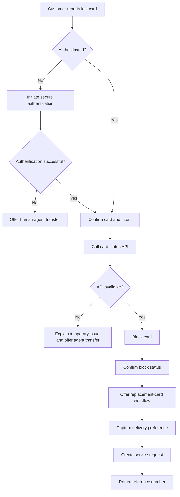

# Banking Conversational AI Blueprint

## Example: Lost or Stolen Card

## Delivery considerations

- Authentication must be handled outside free-form LLM generation.
- Sensitive card data must never be inserted into prompts unnecessarily.
- API failures require deterministic fallback handling.
- High-risk actions should generate auditable events.
- Customer-facing confirmations should use API truth, not model inference.
