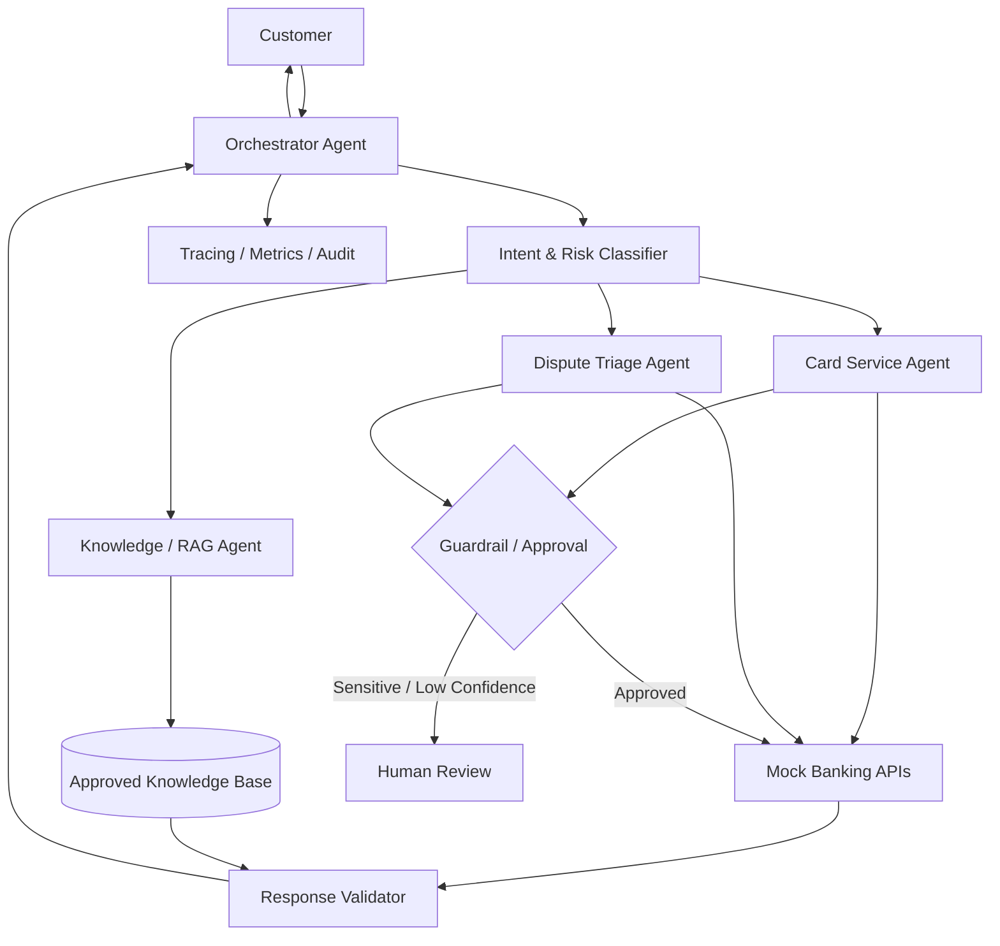
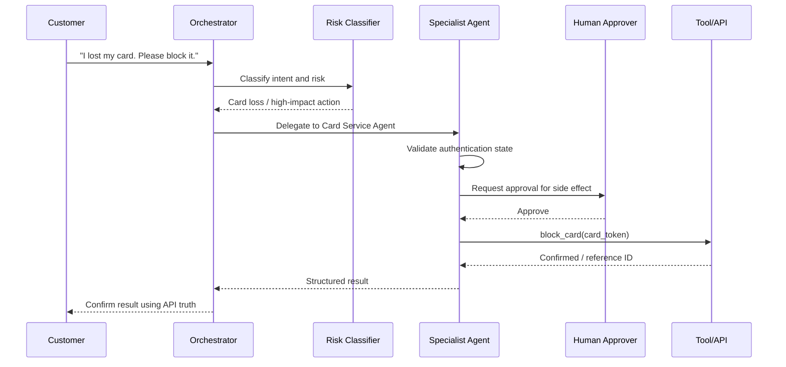

# Banking Service GenAI + Agentic AI Assistant

> **Portfolio project — illustrative only.** This is a generic design created to demonstrate technical-program and delivery fluency. It is not a production banking system and contains no client data, credentials, or proprietary implementation.

## Business problem

Bank customer-service teams handle high volumes of repetitive requests while sensitive actions still require authentication, policy checks, auditable APIs, and sometimes human approval.

This sample solution separates **Generative AI** from **Agentic AI**:

- **Generative AI:** understands natural-language requests, summarizes context, retrieves approved knowledge, and drafts grounded responses.
- **Agentic AI:** plans the next step, routes work to specialist agents, calls approved tools, checks results, and pauses for human approval before sensitive actions.

## Example use cases

1. Explain card-blocking or replacement policy.
2. Summarize a transaction-dispute request.
3. Retrieve approved FAQ/policy information.
4. Route a service request to the correct specialist.
5. Simulate a card-block request through a mock API.
6. Escalate high-risk or low-confidence cases to a human.

## Architecture

## End-to-end flow

## Why this matters to a Technical Program Manager

The program manager does not need to write every model or API. The leadership responsibility is to make sure product, architecture, AI engineering, API teams, security, QA, compliance, operations, and business owners agree on:

- scope and supported journeys,
- system boundaries,
- data/privacy controls,
- human approvals,
- API dependencies,
- acceptance criteria,
- evaluation metrics,
- release readiness,
- incident ownership,
- and measurable business outcomes.

## Suggested KPIs

| Dimension | Example metric |
|---|---|
| Customer | CSAT, containment rate |
| AI quality | grounded-answer rate, task success |
| Risk | unsafe-action blocks, human escalations |
| Engineering | latency, API success rate |
| Delivery | milestone predictability, escaped defects |
| Operations | incident rate, mean time to recovery |

## Contents

- `src/agent_workflow.py` — framework-neutral executable simulation of the agent workflow.
- `prompts/system-prompts.md` — example prompt contracts.
- `docs/rag-design.md` — simple RAG explanation and controls.
- `docs/evaluation-plan.md` — quality/evaluation strategy.
- `docs/program-delivery-plan.md` — program-manager delivery view.
- `tests/test-scenarios.md` — business and safety test scenarios.

## Interview positioning

Explain this as a **solution blueprint and working workflow simulation**, not as a claim that you built a production banking platform. The value is showing that you understand how GenAI, agent orchestration, APIs, guardrails, human approvals, testing, and program governance fit together.
