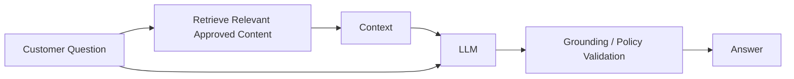

# RAG Design — Explained Simply

RAG means **Retrieval-Augmented Generation**.

Think of an LLM as a smart employee. Instead of asking the employee to remember every bank policy, we first give the employee the latest approved policy document, then ask for an answer based on that document.

## Flow

## Enterprise controls

- Only approved sources enter the searchable knowledge base.
- Documents carry version and ownership metadata.
- Retrieval permissions follow the user's authorization.
- Responses should be traceable to evidence.
- Low-confidence retrieval triggers clarification or escalation.
- Sensitive data should not be indexed without an approved design.

## Example

Customer: "What documents are needed for a replacement card?"

The system retrieves the current approved replacement-card policy and asks the model to answer only from that evidence. If no approved evidence is found, it should not invent an answer.
